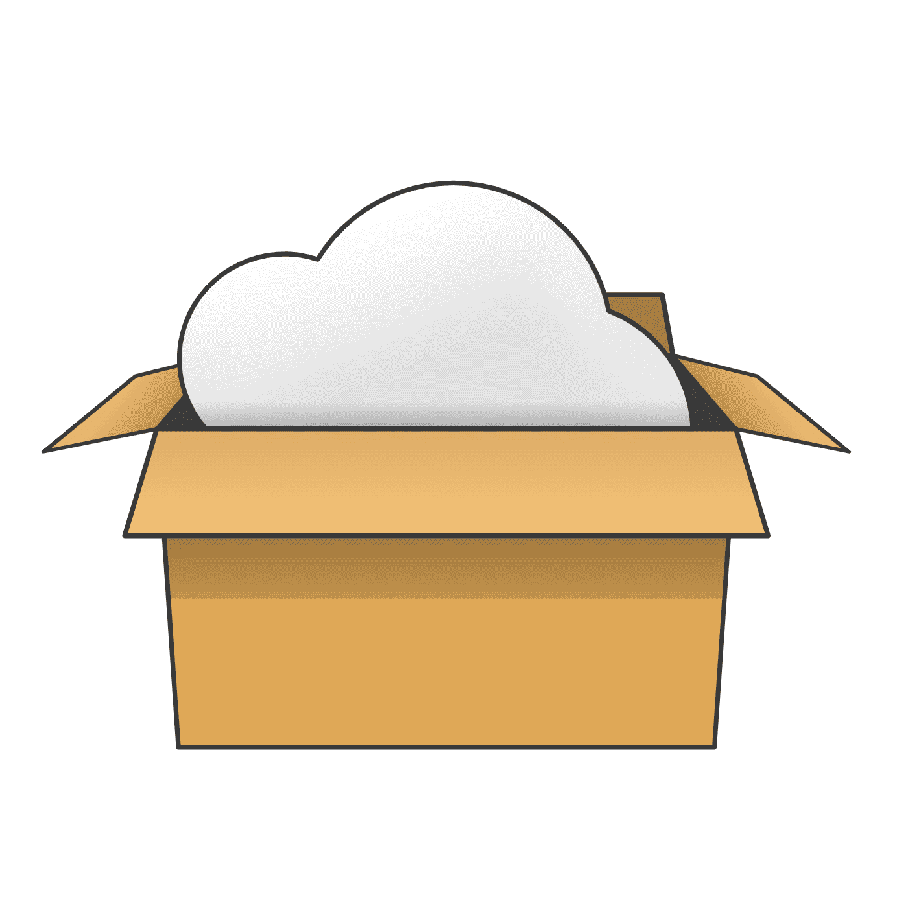

# GONEList

这是一款使用 `golang + vue` 编写的基于 onedrive 的**在线共享网盘**  
效果展示：https://gonelist.cugxuan.cn  
前端项目地址：https://github.com/Sillywa/gonelist-web  
详细文档地址：https://gonelist-doc.cugxuan.cn
有问题请提 issue，也可以进入 QQ 群交流，群号：1083165608

# 功能特性

- 「跨平台」，兼容 Linux/Windows/MacOS 等多个平台
- 「极速部署」，下载对应程序，修改配置即可前后端一键部署
- 「直链下载」，文件直链下载，下载不消耗服务器流量
- 「自动刷新」，自动刷新缓存，可自定义时间
- 「自定义目录」，支持将 onedrive 的某个目录作为根目录
- 「在线播放」，支持在线播放音频和视频
- 「海量文件」，支持单目录下上千个文件，正常使用
- 「多平台」，支持个人版、教育账号、世纪互联等
- 「README」，支持页面添加 README
- ...

注：支持绝大部分教育账号，部分 **教育账号** 因为需要管理员同意无法使用