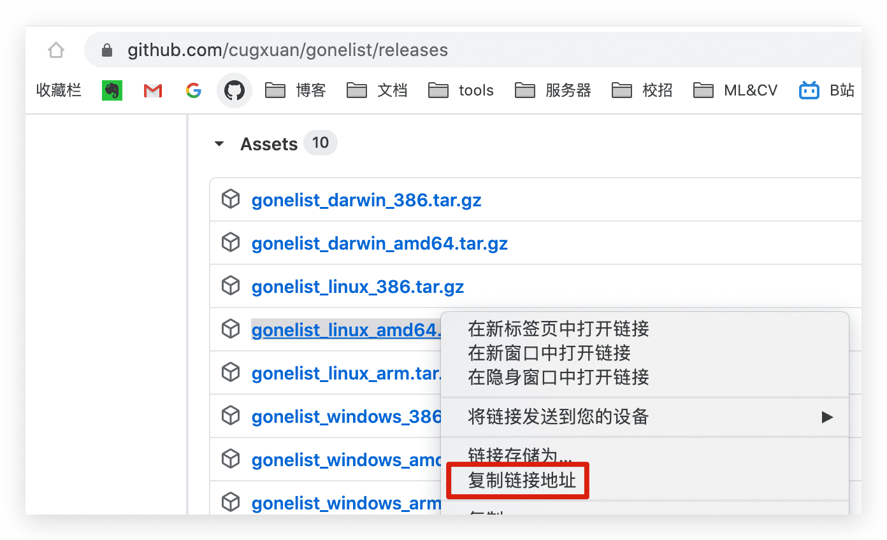
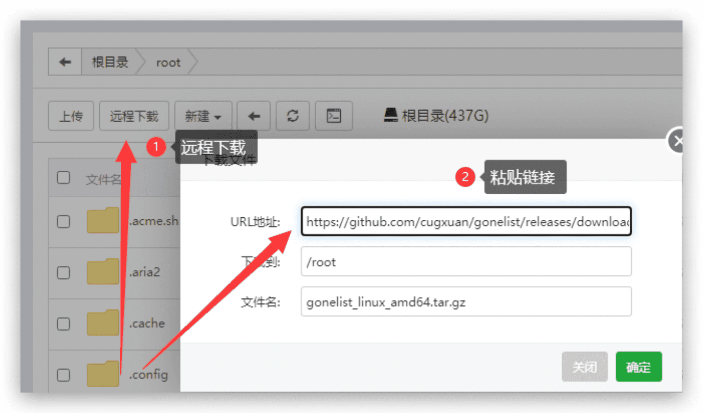
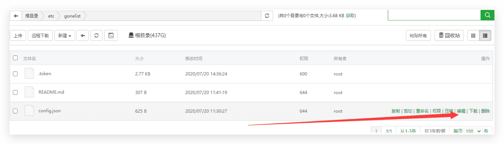

# 宝塔配置

宝塔搭建过程省略

## 获取客户端 id 和密码

首先你需要创建一个应用，获取客户端 id 与客户端密码
如果没有，请先看 [安装文档](install) 中的创建应用的部分

## 下载应用程序包和安装脚本

复制最新的程序包下载链接，到宝塔面板远程下载
可以到 [github-release](https://github.com/cugxuan/gonelist/releases) 中下载最新的版本

github-release 请下载最新的 release，举个例子，Linux 系统复制 gonelist_linux_amd64.tar.gz 的链接，具体操作如图



打开并且登陆宝塔界面，进入 root 文件夹，开始远程下载



之前复制的链接是程序安装包，还需要下载安装脚本，用同样的方法下载下面这个链接

```
https://raw.githubusercontent.com/cugxuan/gonelist/master/scripts/install-release.sh
```

## 安装和修改参数

在宝塔中使用终端运行脚本，先进入 /root

```
$ cd /root
$ bash install-release.sh -l gonelist_linux_amd64.tar.gz
```

运行之后会生成一些文件，修改 /etc/gonelist/config.json 里面的参数，参照 [参数配置](parameter)
建议填入自己的 client_id 以及 client_secret，folder_sub
folder_sub 可以设置 GONEList 的根目录是从 onedrive 的什么地方开始



## 运行

```
// 启动 gonelist 应用
$ systemctl start gonelist
// 停止 gonelist 应用
$ systemctl stop gonelist
// 查看应用状态
$ systemctl status gonelist
```

启动之后按照正常流程授权访问跳转即可

应用也可以在宝塔中停止

